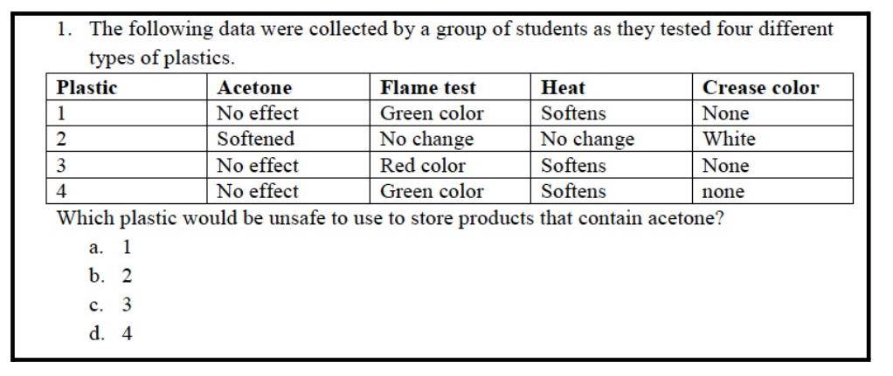

# Document Table Extraction API

## Goal

The goal of this project was to create an AI-based API that can extract tabular data from images of documents. The
system detects tables within images, extracts their textual data, and structures the output in a JSON format. The
solution leverages machine learning models for table detection and Optical Character Recognition (OCR) for text
extraction.

## Solution Overview

To solve the problem, two core modules were implemented:

1. **Table Detection**: Using a YOLO-based model for detecting and cropping tables from document images.
2. **Text Extraction**: Using PaddleOCR to perform OCR on the cropped table images to extract the textual data.

The process works as follows:

- **Table Detection**: A YOLO-based model scans the image and detects tables by drawing bounding boxes around them.
- **Text Extraction**: The cropped table images are then processed with OCR to extract the text in a structured format.
- The results are then returned as a JSON response containing the table data, structured by rows.

## How It Works

1. **Table Detection**: Detects and crops the table from the input image.
2. **OCR Processing**: Extracts the text from the cropped table image using PaddleOCR.
3. **Data Structuring**: Organizes the detected text into rows and formats it into a JSON object.

### Expected Input

The API expects an image file in the key `image` uploaded via a POST request to the endpoint `/extract_text_from_image`.
The image should contain a document with a single table. For example:

- **Input**: An image file containing a table like the example below.
  

### Expected Output

The output is a JSON object containing the extracted table data in rows. The structure will be as follows:

```json
[
  {
    "rows": [
      {
        "data": [
          "Plastic",
          "Acetone",
          "Flame test",
          "Heat",
          "Crease color"
        ],
        "row_no": 1
      },
      {
        "data": [
          "11",
          "No effect",
          "Green color",
          "Softens",
          "None"
        ],
        "row_no": 2
      },
      {
        "data": [
          "2",
          "Softened",
          "No change",
          "No change",
          "White"
        ],
        "row_no": 3
      },
      {
        "data": [
          "3",
          "No effect",
          "Red color",
          "Softens",
          "None"
        ],
        "row_no": 4
      },
      {
        "data": [
          "4",
          "No effect",
          "Green color",
          "Softens",
          "none"
        ],
        "row_no": 5
      }
    ],
    "table_no": 1
  }
]
```

### Steps to Run the Repo

1. **Clone the repository**:
    ```bash
    git clone https://github.com/hamidriasat/table_text_extractor.git
    cd table_text_extractor
    ```

2. **Set up the environment**:
   Make sure you are using Python 3.10 or above.

   Install the dependencies by running:
    ```bash
    pip install -r requirements.txt
    ```

3. **Run the Flask API**:
   Start the server by running:
    ```bash
    python app.py
    ```

   The API will be accessible at `http://localhost:8000/`.

4. **Test the API**:
   You can test the endpoint `/extract_text_from_image` by sending a POST request with an image file. For example,
   using `curl`:

    ```bash
    curl -X POST -F "image=@your-image-file.png" http://localhost:8000/extract_text_from_image
    ```

   The expected output will be a JSON response containing the extracted table data.

---
